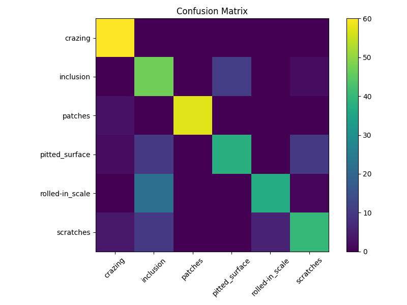
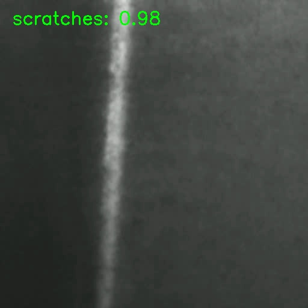

# 🏭 Industrial Surface Defect Detection System

A modular, real-time industrial surface inspection pipeline built using PyTorch and OpenCV.  
This project simulates an automated quality assurance system used in manufacturing environments for detecting steel surface defects.

---

## 📌 Overview

This system performs:

- Deep learning-based defect classification (CNN)
- Real-time video inspection
- Confidence-based defect detection
- Alert triggering with cooldown logic
- Automatic defect frame capture
- Event logging
- FPS performance monitoring
- TorchScript export for edge deployment

The project is inspired by real industrial quality monitoring systems used in steel production and manufacturing lines.

---

## 🧠 Problem Statement

In manufacturing environments, surface defects such as cracks, inclusions, scratches, and scaling can significantly impact product quality. Manual inspection is:

- Slow  
- Inconsistent  
- Labor-intensive  

This system demonstrates how AI can automate real-time defect monitoring.

---

## 📂 Dataset

**NEU Surface Defect Dataset (NEU-DET)**

Contains 6 classes of steel surface defects:

- crazing  
- inclusion  
- patches  
- pitted_surface  
- rolled-in_scale  
- scratches  

Each class contains grayscale surface texture images.

---

## 🏗 System Architecture

```
Input (Camera / Video)
        ↓
Frame Preprocessing
        ↓
CNN Inference
        ↓
Softmax Confidence
        ↓
Normal Surface / Defect Decision
        ↓
Alert System + Cooldown
        ↓
Frame Capture + Logging
        ↓
Performance Monitoring (FPS)
```

---

## 🧪 Model Details

- Architecture: Custom CNN  
- Framework: PyTorch  
- Input Resolution: 128×128  
- Optimizer: Adam  
- Loss: CrossEntropyLoss  
- Device: Apple M1 (MPS acceleration)  

---

## 📊 Model Performance

**Best Validation Accuracy:** 77.50%

### Classification Summary

- Overall Accuracy: **78%**
- Balanced performance across 6 defect categories
- Strong detection for crazing and patches
- Moderate confusion between inclusion and rolled-in_scale (texture similarity)

Confusion matrix is saved at:

```
results/confusion_matrix.png
```

---

## 🚀 Features

### ✅ Real-Time Monitoring
Processes video streams frame-by-frame.

### ✅ Normal Surface Detection
Frames below confidence threshold are labeled:

```
Normal Surface
```

### ✅ Confidence-Based Color Coding
- Green → High confidence  
- Yellow → Medium confidence  
- Red → Low confidence  

### ✅ Alert System
- Triggers only above threshold  
- Cooldown logic prevents alert spam  
- Saves defect frames automatically  

### ✅ Logging
Logs timestamp, class, and confidence to CSV.

### ✅ FPS Monitoring
Displays real-time inference speed.

### ✅ Edge Deployment Ready
Model exported to TorchScript format:

```
results/model_scripted.pt
```

---

## 📁 Project Structure

```
Industrial-Defect-Detection/
│
├── data/
│   └── NEU-DET/
│
├── results/
│   ├── best_model.pth
│   ├── model_scripted.pt
│   ├── confusion_matrix.png
│   └── defects/
│
├── src/
│   ├── model.py
│   ├── train.py
│   ├── inference.py
│   ├── alert.py
│   ├── logger.py
│   ├── main.py
│   ├── create_demo_video.py
│   └── export_model.py
│
├── requirements.txt
└── README.md
```

---

## ⚙️ Installation

### 1️⃣ Clone Repository

```bash
git clone https://github.com/your-username/Industrial-Defect-Detection.git
cd Industrial-Defect-Detection
```

### 2️⃣ Create Virtual Environment

```bash
python3 -m venv venv
source venv/bin/activate
```

### 3️⃣ Install Dependencies

```bash
pip install -r requirements.txt
```

---

## 🏋️ Training

```bash
python src/train.py
```

Outputs:

- best_model.pth  
- confusion_matrix.png  
- classification report  

---

## 🎥 Create Demo Inspection Video

```bash
python src/create_demo_video.py
```

Creates:

```
results/demo_inspection_video.mp4
```

---

## 🏭 Run Real-Time Inspection

### Webcam Mode

```bash
python src/main.py
```

### Video Mode

```bash
python src/main.py --video results/demo_inspection_video.mp4
```

---

## 📦 Export TorchScript Model

```bash
python src/export_model.py
```

---

## 🐳 Docker Support

Build image:

```bash
docker build -t industrial-defect-app .
```

Run (headless mode):

```bash
docker run -e HEADLESS=1 industrial-defect-app
```

```bash
docker run -e HEADLESS=1 industrial-defect-app --video results/demo_inspection_video.mp4
```

---

## 📸 System Output

### Confusion Matrix


### Defect Capture Example


---

## ⚠ Limitations

- Classification-based (no bounding box localization)  
- Sensitive to extreme lighting variations  
- Trained only on NEU-DET dataset  
- Not yet optimized for high-throughput industrial GPUs  

---

## 🚀 Future Improvements

- Object detection (YOLO-based defect localization)  
- ONNX export for edge devices  
- REST API deployment  
- Integration with conveyor belt camera feeds  
- Cloud-based monitoring dashboard  

---

## 👩‍💻 Author

**Srishti Sindgi**

AI/ML Engineering Student  
Focused on Industrial AI & Real-Time Systems  

GitHub: https://github.com/sindgisrishtis
